# PROVIDER Ontology

PROVIDER project ontology for modelling cross-sector supply chains, disruptions,
resilience capabilities, monitoring signals, impacts, mitigation actions, and
their relationship to infrastructure.

The current ontology is intentionally modular. The core ontology describes the
domain vocabulary used by PROVIDER use cases, while the supply-chain operations
module specializes the core for orders, inventory, shipments, documents, and
operational processes. The BFO alignment module places core vocabulary under
Basic Formal Ontology categories. OSM-derived infrastructure classes are expected
to align later through the core classes `InfrastructureAsset`,
`TransportInfrastructureAsset`, `Route`, and `Network`.

## Files

| File | Purpose |
| --- | --- |
| `ontology/provider-main.ttl` | Main PROVIDER core ontology in Turtle. |
| `ontology/supply_chain_ontology.ttl` | Supply-chain operations module importing the PROVIDER core. |
| `ontology/provider-bfo-alignment.ttl` | Separate BFO alignment module for the core ontology. |
| `ontology/provider-main.xml` | Earlier RDF/XML export containing initial sector classes. Currently behind the Turtle source. |
| `ontology/infrastructure.ttl` | OSM-oriented infrastructure ontology draft. |
| `ontology/infrastructure_network.ttl` | Draft network abstraction layer for infrastructure topology. |
| `use-cases/soybean/soybean.md` | Soybean supply-chain disruption use case used to shape the core vocabulary. |
| `use-cases/soybean/example_data.ttl` | Example soybean data using the supply-chain operations module. |

## Core Ontology

`ontology/provider-main.ttl` defines a compact upper layer for PROVIDER use
cases. It is not an OSM ontology itself; it provides the cross-domain concepts
that OSM-derived infrastructure can later attach to.

Main class groups:

- Context and organization: `Sector`, `Region`, `Actor`, `Organization`
- Physical and operational assets: `Facility`, `InfrastructureAsset`
- Supply-chain structure: `SupplyChain`, `SupplyChainStage`, `Flow`, `Route`, `Network`
- Products and traded goods: `Product`, `Commodity`
- Roles: `SupplyChainRole`, `SupplierRole`, `ProducerRole`, `FarmerRole`, `TraderRole`, `CarrierRole`, `CustomerRole`, `ProcessorRole`, `RegulatorRole`
- Events and risk: `Hazard`, `Exposure`, `Vulnerability`, `Risk`, `Event`, `DisruptionEvent`, `DisasterEvent`, `InfrastructureOutageEvent`, `MarketShockEvent`, `PriceRiseEvent`
- Monitoring and assessment: `DataSource`, `Indicator`, `Observation`, `MonitoringSignal`, `Impact`
- Response and resilience: `ResilienceCapability`, `MitigationAction`, `DiversificationAction`, `BufferStockAction`, `ReroutingAction`, `SubstitutionAction`, `EmergencyProcurementAction`

Important object properties:

- `hasStage`, `precedesStage` for supply-chain structure
- `handlesProduct`, `hasInput`, `hasOutput` for product and process modelling
- `originatesAt`, `terminatesAt`, `movesAlong` for flows and routes
- `affectedBy`, `affects`, `causes`, `dependsOn`, `hasHazard`,
  `hasExposure`, `hasVulnerability`, `hasResilienceCapability` for risk and
  disruption propagation
- `observesIndicator`, `observedFor`, `indicates`, `derivedFrom` for monitoring
- `mitigates`, `implementedBy` for resilience actions

The core uses a role-based hybrid model. Organizations and facilities are
separate: a farm site is a `Farm` facility, while a farm business is an
`Organization` bearing `FarmerRole` or `ProducerRole`. Deprecated compatibility
terms such as `Organisation`, `CommercialOrganisation`, `Wholesaler`, and
`operatesInSector` remain available for older data, but new data should use
`Organization`, explicit roles, and `hasSector`.

## Supply-Chain Operations Module

`ontology/supply_chain_ontology.ttl` imports `ontology/provider-main.ttl` and
keeps operational vocabulary that is useful for supply-chain datasets:

- `Warehouse`, `ManufacturingPlant`, `DistributionCenter`
- `Inventory`, `Batch`, `MaterialItem`
- `Order`, `PurchaseOrder`, `SalesOrder`, `ShipmentDocument`, `Invoice`
- `SupplyChainProcess` and process subclasses for procurement, transportation,
  storage, fulfillment, delivery, inspection, and manufacturing
- supply-chain qualities such as quantity, weight, temperature, lead time, and
  inventory status

The module uses the canonical namespace
`http://projekt-provider.de/ontology/supply-chain#`. Its duplicate-looking
upper classes `sc:Organization`, `sc:Facility`, and `sc:Product` are aliases of
the core `Organization`, `Facility`, and `Product`, retained for existing
supply-chain datasets.

The core keeps infrastructure hooks deliberately broad. For example, an OSM
port class can later be placed below `TransferFacility` or
`TransportInfrastructureAsset`; an OSM road network can specialize `Network`;
and an OSM route relation can specialize `Route`.

## BFO Alignment

`ontology/provider-bfo-alignment.ttl` is a separate module that imports the
PROVIDER core and BFO. It uses conservative `rdfs:subClassOf` mappings rather
than `owl:equivalentClass` mappings.

The intent is to make the ontological commitments explicit while still allowing
the PROVIDER domain model to evolve.

Representative alignments:

| PROVIDER class | BFO target | Rationale |
| --- | --- | --- |
| `Sector` | `bfo:BFO_0000141` immaterial entity | A sector is a social/analytic grouping, not a single physical object. |
| `Region` | `bfo:BFO_0000141` immaterial entity | Regions may be administrative, economic, or analytic regions. Concrete sites can be specialized later. |
| `Organization` | `bfo:BFO_0000027` object aggregate | Organizations aggregate people, assets, and institutional parts. |
| `Facility`, `InfrastructureAsset` | `bfo:BFO_0000040` material entity | Facilities and infrastructure assets are treated as physical entities. |
| `SupplyChain`, `SupplyChainStage`, `Route` | `bfo:BFO_0000031` generically dependent continuant | These are treated as models, plans, or informational structures. |
| `Network` | `bfo:BFO_0000027` object aggregate | A physical network aggregates connected infrastructure elements. |
| `Process`, `Flow`, `Event`, `MitigationAction` | `bfo:BFO_0000015` process | These unfold over time. |
| `Risk`, `Vulnerability`, `ResilienceCapability` | `bfo:BFO_0000016` disposition | These are treated as realizable tendencies or capabilities under triggering conditions. |
| `Role`, `SupplyChainRole` | `bfo:BFO_0000023` role | Actor types such as supplier or carrier are represented as roles. |
| `Indicator`, `Observation`, `MonitoringSignal` | `bfo:BFO_0000031` generically dependent continuant | These are information artifacts or records. |

Some classes are intentionally marked with `skos:scopeNote` because their BFO
placement depends on modelling choices:

- `Product` and `Commodity` may be material goods, energy products, certificates,
  or services.
- `Route` may be an information-bearing path, while a physical corridor may be
  modelled separately as a site or infrastructure asset.
- `Producer`, `Trader`, `Carrier`, `Processor`, `Regulator`, and `Retailer` are
  retained as deprecated convenience classes. New modelling should use
  `Organization` plus explicit supply-chain roles.
- `Impact` is kept broad until subclasses distinguish realized impact processes,
  impact qualities, and impact reports.

## High-Level Diagram

The following Mermaid diagram sketches the intended architecture. It can be
imported into Excalidraw via Mermaid-to-diagram workflows.

```mermaid
flowchart TB
  subgraph BFO["Basic Formal Ontology"]
    BFOEntity["entity"]
    BFOContinuant["continuant"]
    BFOOccurrent["occurrent / process"]
    BFOMaterial["material entity"]
    BFOImmaterial["immaterial entity"]
    BFOGDC["generically dependent continuant"]
    BFODisposition["disposition"]

    BFOEntity --> BFOContinuant
    BFOEntity --> BFOOccurrent
    BFOContinuant --> BFOMaterial
    BFOContinuant --> BFOImmaterial
    BFOContinuant --> BFOGDC
    BFOContinuant --> BFODisposition
  end

  subgraph Core["PROVIDER Core Ontology"]
    Sector["Sector"]
    Region["Region"]
    Actor["Actor / Organization"]
    Facility["Facility"]
    Infra["InfrastructureAsset"]
    SupplyChain["SupplyChain"]
    Stage["SupplyChainStage"]
    Product["Product / Commodity"]
    Flow["Flow"]
    Route["Route"]
    Network["Network"]
    Event["Event / DisruptionEvent"]
    Risk["Risk"]
    Vulnerability["Exposure / Vulnerability"]
    Impact["Impact"]
    Indicator["Indicator"]
    Observation["Observation / MonitoringSignal"]
    Mitigation["MitigationAction"]
    Capability["ResilienceCapability"]
  end

  subgraph OSM["Future OSM Infrastructure Module"]
    OSMPort["Port"]
    OSMRoad["Road / RoadSegment"]
    OSMRail["Railway / RailwaySegment"]
    OSMWater["Waterway / Canal"]
    OSMPower["PowerLine / Substation"]
    OSMNetwork["OSM Network / Route"]
  end

  BFOImmaterial -.alignment.-> Sector
  BFOImmaterial -.alignment.-> Region
  BFOMaterial -.alignment.-> Actor
  BFOMaterial -.alignment.-> Facility
  BFOMaterial -.alignment.-> Infra
  BFOGDC -.alignment.-> SupplyChain
  BFOGDC -.alignment.-> Stage
  BFOGDC -.alignment.-> Route
  BFOGDC -.alignment.-> Indicator
  BFOGDC -.alignment.-> Observation
  BFOOccurrent -.alignment.-> Flow
  BFOOccurrent -.alignment.-> Event
  BFOOccurrent -.alignment.-> Mitigation
  BFODisposition -.alignment.-> Risk
  BFODisposition -.alignment.-> Vulnerability
  BFODisposition -.alignment.-> Capability

  SupplyChain -->|hasStage| Stage
  Stage -->|precedesStage| Stage
  Actor -->|operatesFacility| Facility
  Stage -->|handlesProduct| Product
  Flow -->|originatesAt| Facility
  Flow -->|terminatesAt| Facility
  Flow -->|movesAlong| Route
  Route -->|uses| Network
  Event -->|affects| Stage
  Event -->|causes| Impact
  Risk -->|has exposure / vulnerability| Vulnerability
  Risk -->|realized through| Event
  Observation -->|observesIndicator| Indicator
  Observation -->|indicates| Risk
  Mitigation -->|mitigates| Risk

  OSMPort -.subClassOf.-> Infra
  OSMPort -.subClassOf.-> Facility
  OSMRoad -.subClassOf.-> Infra
  OSMRail -.subClassOf.-> Infra
  OSMWater -.subClassOf.-> Infra
  OSMPower -.subClassOf.-> Infra
  OSMNetwork -.subClassOf.-> Network
  OSMNetwork -.subClassOf.-> Route
```



## Soybean Use Case Fit

The soybean scenario can be represented as a supply chain with stages such as
farming, storage, inland logistics, export port handling, ocean transport, EU
import, crushing, feed production, livestock production, and retail.

Examples:

- Soybeans, soymeal, and soyoil are `Commodity` instances or subclasses.
- Farms, silos, ports, crushing plants, feed mills, and livestock farms are
  `Facility` specializations; farm businesses are `Organization` instances with
  `FarmerRole` or `ProducerRole`.
- Drought, crop disease, port strike, export ban, infrastructure outage, and
  freight price spike are `DisruptionEvent` specializations or instances.
- NDVI, yield forecast, port throughput, freight rate, lead time, inventory days
  cover, and consumer price index are `Indicator` instances.
- Forecasts, measurements, and alerts are `Observation` or `MonitoringSignal`
  instances.
- Supplier diversification, safety stock, flexible recipes, and alternative
  approved suppliers are `MitigationAction` instances.

## Validation

Syntax validation commands used during development:

```sh
rapper -i turtle -c ontology/provider-main.ttl
rapper -i turtle -c ontology/supply_chain_ontology.ttl
rapper -i turtle -c ontology/provider-bfo-alignment.ttl
riot --validate ontology/provider-main.ttl
riot --validate ontology/supply_chain_ontology.ttl
riot --validate ontology/provider-bfo-alignment.ttl
```

Known state:

- `ontology/provider-main.ttl` is the canonical Turtle source for the core ontology.
- Root-level `provider-main.ttl` is an older draft reference and is not the maintained source of truth.
- `ontology/supply_chain_ontology.ttl` imports the core and uses the canonical HTTP namespace.
- `ontology/provider-bfo-alignment.ttl` is the current BFO alignment module.
- `ontology/provider-main.xml` has not been regenerated from the Turtle source.
- `ontology/infrastructure_network.ttl` still needs prefix declarations before
  it can be parsed as a standalone Turtle file.
